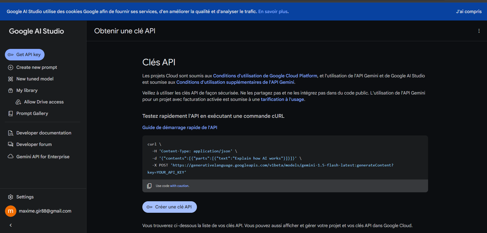
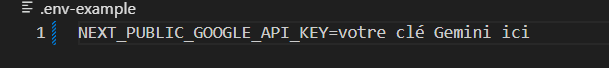
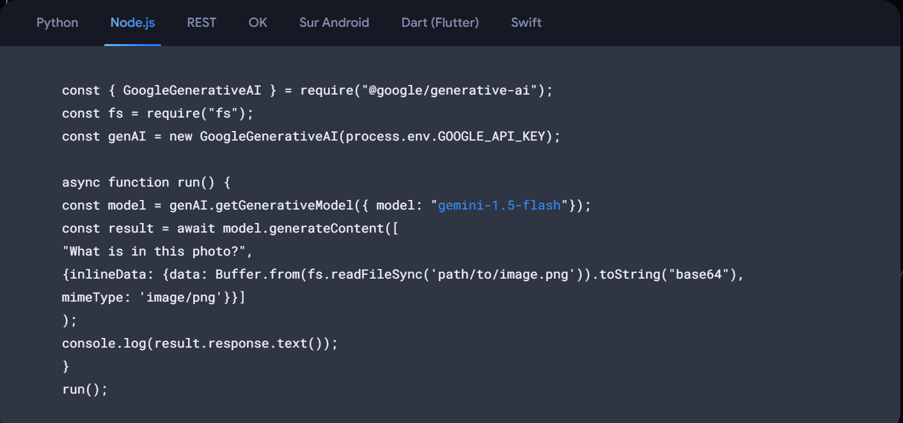
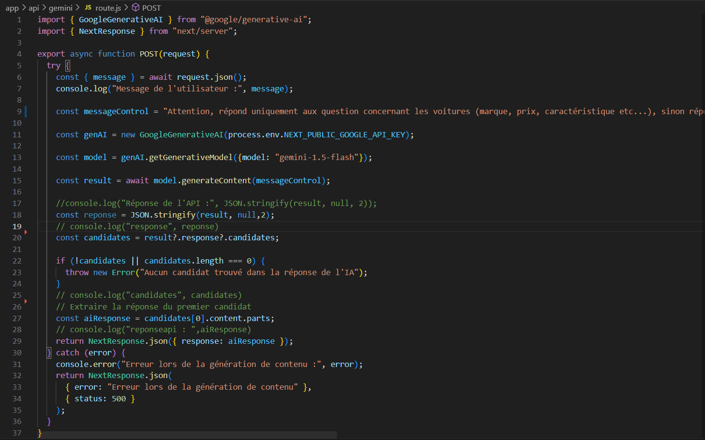
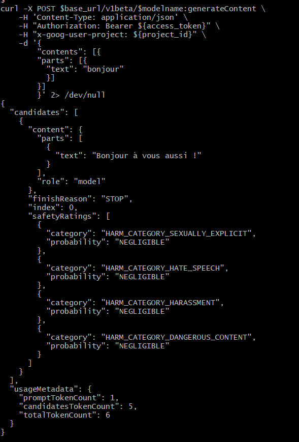

## Presentation du chatbot

Ce chatbot permet de poser des questions a Gemini concernant uniquement le dommaine automobile, les specs d'une voiture son prix etc...
voici le rapport technique détaillant mon travail.

## Creation du projet NodeJS

pour créer le projet on utilise la commande

````bash
npm init -y
````

Installation de la librairie dotenv:

````bash
npm install dotenv
````
ensuite j'ai utiliser next pour simplifier la conception et le deploiement (avec vercel) de mon outil

## Connexion avec l'api Gemini

Tout d'abord il faut récupérer une clé API sur le site de google : https://ai.google.dev/gemini-api?utm_source=google&utm_medium=cpc&utm_campaign=core-brand-eur-sem&utm_id=21341690381&gad_source=1&gclid=CjwKCAjwl6-3BhBWEiwApN6_kqL7F0V-PAva1agdzaNBw5_GZu5bG3x_IiOo9vBtiFDZmQ7o3MCGvBoCDasQAvD_BwE&hl=fr



Cette clé, nous allons la stocker dans un fichier ".env" comme ceci: 

Ensuite nous pouvons utiliser le code présent sur la page google donné ci-dessus pour configurer une première communication avec l'API Gemini : 


cependant, dans notre cas nous allons avoir besoin d'interagir avec notre interface web, alors j'ai créer sur mon projet un fichier pour mon api sous 'app/api/gemini/routes.js' avec le code suivant : 


ici, on récupère le message de l'utilisateur, on l'envoie à notre api qui nous retourne une réponse en json qu'on affiche donc sur notre page de chat.

## Interface Utilisateur

Dans cette interface utilisateur, on a un chat sous forme de téléphone où l'utilisateur peut envoyer des messages et recevoir des réponses de l'ia. Le code utilise React avec la fonction useState pour gérer l'état des messages et de l'entrée de texte.

Affichage du titre et du chat :


Chaque message est soit de l'utilisateur (en vert), soit de l'IA (en gris), et les messages sont affichés dans une boîte qui se remplit au fur et à mesure des échanges. On vérifie le rôle du message afin de savoir si on affiche le message en vert ou en gris.

Envoi de message :

L'utilisateur tape un message dans un champ de texte et peut l'envoyer en appuyant sur "Entrée" ou en cliquant sur le bouton.
Le message est envoyé sous forme de requète POST à l'api (/api/gemini), qui répond avec un message de l'IA, affiché à son tour dans la boîte de chat.
CSS inline :

Le style de l'interface est défini directement dans le code avec des objets styles pour organiser l'affichage.

## File-tuning 

Pour cette étape j'ai utiliser le tuto google prévu à cet effet :
https://ai.google.dev/gemini-api/docs/model-tuning/tutorial?hl=fr&lang=rest
Pour creer un model modifier il nous faut tout d'abord créer un projet Google cloud, activer l'API Gemini dans notre projet google cloud 

Nous devons ensuite configurer l'authentification O2Auth en suivant ces étapes 
https://ai.google.dev/gemini-api/docs/oauth?hl=fr

à la fin de ces étapes nous avons un fichier client_secret.json
qu'on peut placer dans un dossier.

On peut ouvrir git bash (plus pratique pour executer directement des commandes linux) et nous rendre dans le répertoire ou se trouve notre fichier client_secret.json

on peut effectuer cette première commande pour nous connecter :


ceci va nous créer une clé Api qu'on va stocker dans une variable d'environement en utilisant cette commande :


on peut ensuite enregistrer notre project_id se trouvant dans notre dashboard de notre projet google cloud:


on peut donc enregistrer ce project_id et l'url base de l'api gemini en utilisant les commandes suivantes :


on peut donc maintenant créer notre modèle Gemini en suivant la commande qui suit.

````bash
curl -X POST $base_url/v1beta/tunedModels \
    -H 'Content-Type: application/json' \
    -H "Authorization: Bearer ${access_token}" \
    -H "x-goog-user-project: ${project_id}" \
    -d '
    {
      "display_name": "Car-tuning",
      "base_model": "models/gemini-1.0-pro-001",
      "tuning_task": {
        "hyperparameters": {
          "batch_size": 2,
          "learning_rate": 0.001,
          "epoch_count": 5
        },
        "training_data": {
          "examples": {
            "examples": [
              {
                "text_input": "EXEMPLE D ENTREE DE TExTE",
                "output": " EXEMPLE DE LA SORTIE GEMINI VOULU "
              },
              
            ]
          }
        }
      }
    }' | tee tunemodel.json
````

une fois le model génerer, on obtien une réponse comme ceci:

````bash 
{
"name": " tunedModels/car-tuning-f29nv3neiu5x",
"metadata": {
  "@type": "type.googleapis.com/google.ai.generativelanguage.v1beta.CreateTunedModelMetadata",
  "totalSteps": 38,
  "tunedModel": "tunedModels/number-generator-model-dzlmi0gswwqb"
}
}
% Total    % Received % Xferd  Average Speed   Time    Time     Time  Current
                              Dload  Upload   Total   Spent    Left  Speed
100  2280    0   296  100  1984    611   4098 --:--:-- --:--:-- --:--:--  4720
````
on dois enregistrer le nom du model dans une variable d'environement en utilisant la commande suivante :

````bash
export modelname=tunedModels/car-tuning-f29nv3neiu5x
````
on peut regarder l'état du model en utilisant la commande suivante :

````bash

curl -X GET ${base_url}/v1beta/${modelname} \
    -H 'Content-Type: application/json' \
    -H "Authorization: Bearer ${access_token}" \
    -H "x-goog-user-project: ${project_id}" | grep state
````
et on peut faire une requète avec notre model avec la commande suivante :

````bash

curl -X POST $base_url/v1beta/$modelname:generateContent \
    -H 'Content-Type: application/json' \
    -H "Authorization: Bearer ${access_token}" \
    -H "x-goog-user-project: ${project_id}" \
    -d '{
        "contents": [{
        "parts": [{
          "text": "ton texte / ta requete"
          }]
        }]
        }' 2> /dev/null
````

voici ma requête et ma réponse de l'api avec mon modele



## Prompt et définition des limites

pour limiter l'utilisation de mon chatbot au domaine automobile j'ai donner des consignes a mon prompte juste avant le message de l'utilisateur voici le code de mon message envoyer à mon api: 

````bash
const messageControl = "Attention, répond uniquement aux question concernant les voitures (marque, prix, caractéristique etc...), sinon répondre je suis conçu pour répondre à vos questions automobile (Bien entendu si l'utilisateur te dit bonjour, répond lui poliment). Voici le message de l'utilisateur :"+message
````

## Choix technologique

J'ai utiliser Node avec Nextjs qui permet de simplifier la conception et le deploiement de l'interface web, on aurait pu aussi utiliser des framework comme vite ou autre.

J'ai donc pu deployer sur vercel et on peut donc acceder a mon interface avec ce lien :
https://prompt-gemini-maxime-girardet-x75r.vercel.app/

