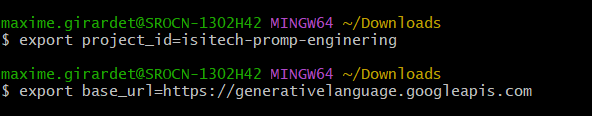

# Creation de projet NodeJS

pour créer le projet 

````bash
npm init -y
````

Installation de la librairie dotenv:

````bash
npm install dotenv
````

# File-tuning 

Pour cette étape j'ai utiliser le tuto google prévu à cet effet :
https://ai.google.dev/gemini-api/docs/model-tuning/tutorial?hl=fr&lang=rest
Pour creer un model modifier il nous faut tout d'abord créer un projet Google cloud, activer l'API Gemini dans notre projet google cloud 

Nous devons ensuite configurer l'authentification O2Auth en suivant ces étapes 
https://ai.google.dev/gemini-api/docs/oauth?hl=fr

à la fin de ces étapes nous avons un fichier client_secret.json
qu'on peut placer dans un dossier.

On peut ouvrir git bash (plus pratique pour executer directement des commandes linux) et nous rendre dans le répertoire ou se trouve notre fichier client_secret.json

on peut effectuer cette première commande pour nous connecter :


ceci va nous créer une clé Api qu'on va stocker dans une variable d'environement en utilisant cette commande :


on peut ensuite enregistrer notre project_id se trouvant dans notre dashboard de notre projet google cloud:


on peut donc enregistrer ce project_id et l'url base de l'api gemini en utilisant les commandes suivantes :


on peut donc maintenant créer notre modèle Gemini en suivant la commande qui suit.

````bash
curl -X POST $base_url/v1beta/tunedModels \
    -H 'Content-Type: application/json' \
    -H "Authorization: Bearer ${access_token}" \
    -H "x-goog-user-project: ${project_id}" \
    -d '
    {
      "display_name": "Golf 7R Roasting",
      "base_model": "models/gemini-1.0-pro-001",
      "tuning_task": {
        "hyperparameters": {
          "batch_size": 2,
          "learning_rate": 0.001,
          "epoch_count": 5
        },
        "training_data": {
          "examples": {
            "examples": [
              {
                "text_input": "EXEMPLE D ENTREE DE TExTE",
                "output": " EXEMPLE DE LA SORTIE GEMINI VOULU "
              },
              
            ]
          }
        }
      }
    }' | tee tunemodel.json
````

